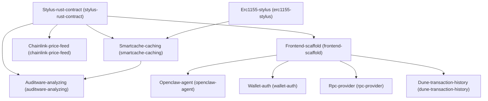

# Architecture

## Dependency Graph

## Execution / Implementation Order

1. **Stylus-rust-contract** (`50f955d3`)
2. **Erc1155-stylus** (`da1c9c2e`)
3. **Frontend-scaffold** (`496362a0`)
4. **Chainlink-price-feed** (`a777ff22`)
5. **Smartcache-caching** (`9f391a03`)
6. **Openclaw-agent** (`ff0f1381`)
7. **Wallet-auth** (`b2d95739`)
8. **Rpc-provider** (`56fc9cc9`)
9. **Dune-transaction-history** (`f2e39b98`)
10. **Auditware-analyzing** (`1a39118b`)
